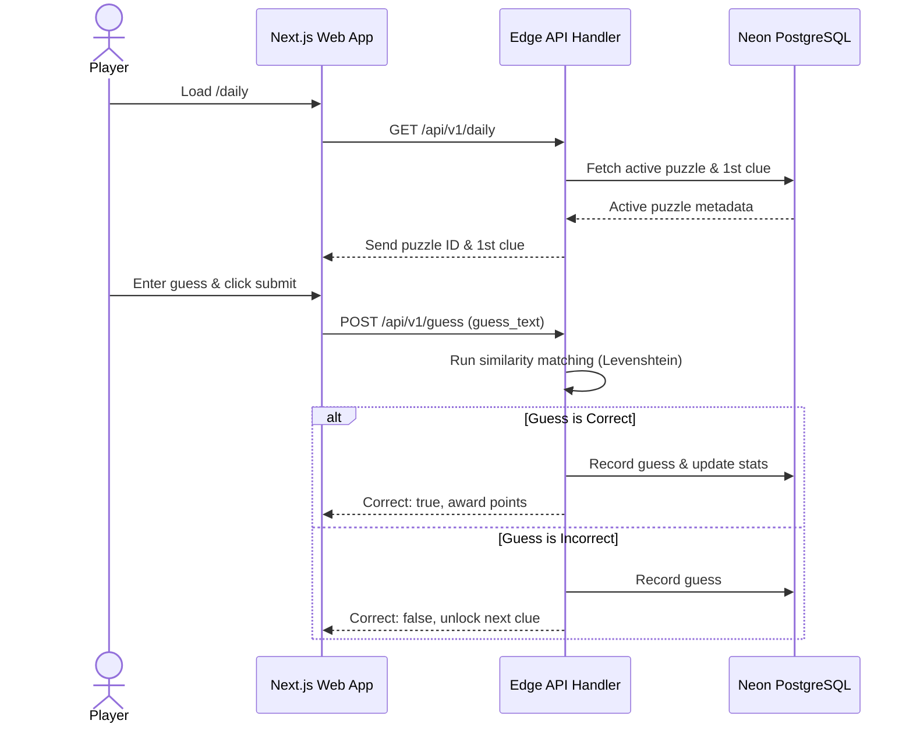

# 🏗️ Master System Architecture

## 🖼️ Game Loop Sequence Diagram

---

## 🚀 Performance Caching Layer
- **Vercel Edge Caching:** Caches the daily puzzle object for 5 minutes.
- **Leaderboards:** Cached database view updating every 60 seconds.
- **Static Assets:** 30 days immutable caching header settings.
